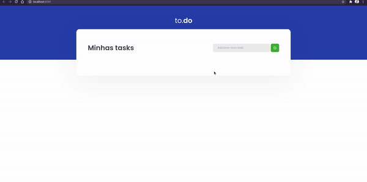

# 💻 Sobre o desafio

Nesse desafio, o meu principal objetivo foi a manipulação do estado no React.

- Adicionar uma nova tarefa
- Remover uma tarefa
- Marcar e desmarcar uma tarefa como concluída

## O que foi editado na aplicação?

Nesse desafio, foi editado apenas o seguinte arquivo `TaskList.tsx` para completar as funcionalidades da aplicação. Esse é o componente responsável por todas as funcionalidades da aplicação, é um componente simples, onde foi colocado em prática várias partes da manipulação do estado.

# 🏃 Rodando a aplicação

Abra no Visual Studio Code e execute os seguintes comandos no terminal:

```bash
yarn
yarn dev
```

Em seguida você pode abri no browser em 'http://localhost:8080'

<p>
  
</p>